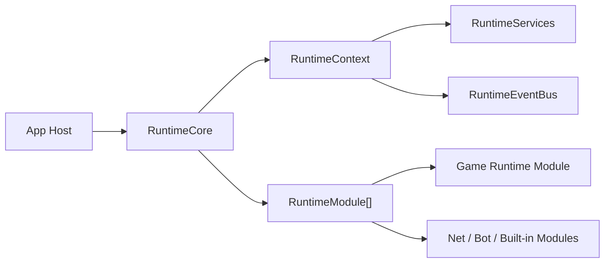

# Runtime Core

`RawIron.Runtime` is the shared lifecycle spine for games and runtime hosts.

## Main types

- `RuntimeIdentity`: stable id, display name, mode, and instance identity
- `RuntimePaths`: workspace, game, save, and config roots
- `RuntimeContext`: current phase, services, event bus, frame state, stop/failure state
- `RuntimeServices`: typed service registry for runtime-owned systems
- `RuntimeModule`: shared startup, frame, pause, resume, and shutdown hooks
- `RuntimeCore`: owns the module list and advances the runtime through its phases

## Runtime phases

- `Uninitialized`
- `Starting`
- `Loading`
- `Running`
- `Paused`
- `Stopping`
- `Stopped`
- `Failed`

## Flow

1. An app host creates `RuntimeIdentity` and `RuntimePaths`.
2. The host constructs `RuntimeCore`.
3. The host adds game modules and optional shared modules.
4. `Startup(...)` advances startup and loading phases.
5. `Frame(...)` drives runtime modules on each step.
6. `Pause(...)`, `Resume()`, and `Shutdown()` keep lifecycle handling centralized.

## What belongs here

- startup and shutdown order
- frame ticking
- runtime event flow
- shared service registration and lookup
- stop/failure propagation
- host adapters for app-facing main loops

## What games do

Games do not create a separate lifecycle convention. A game mounts a runtime module and boots through the shared runtime core. The game may own world assembly, authored behavior, and presentation choices that are intentionally exposed through engine contracts.

## Built-in integration points

`RuntimeCore::AddDefaultModules()` registers built-in runtime helpers, and app hosts can wrap a runtime through `RuntimeHostAdapter` or mount another `ri::core::Host` through `RuntimeHostModule`.
