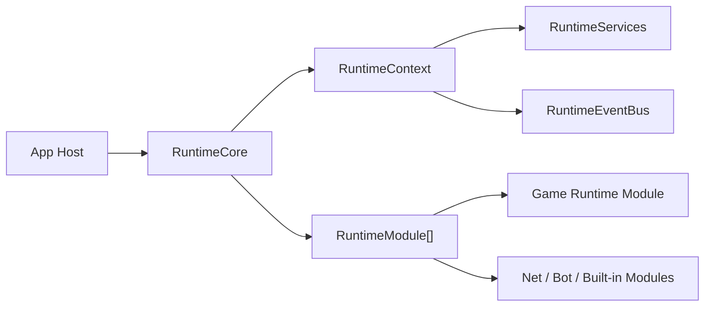

# Runtime Core

`RawIron.Runtime` is the shared lifecycle spine for games and runtime hosts.

## Main types

- `RuntimeIdentity`: stable id, display name, mode, and instance identity
- `RuntimePaths`: workspace, game, save, and config roots
- `RuntimeContext`: current phase, services, event bus, frame state, stop/failure state
- `RuntimeServices`: typed service registry for runtime-owned systems
- `RuntimeModule`: shared startup, frame, pause, resume, and shutdown hooks
- `RuntimeCore`: owns the module list and advances the runtime through its phases
- `JobSystem`: shared CPU worker pool with fences, range dispatch, nested-wait helping, metrics,
  failure propagation, and deterministic drain/cancel shutdown

## Runtime phases

- `Uninitialized`
- `Starting`
- `Loading`
- `Running`
- `Paused`
- `Stopping`
- `Stopped`
- `Failed`

## Flow

1. An app host creates `RuntimeIdentity` and `RuntimePaths`.
2. The host constructs `RuntimeCore`.
3. The host adds game modules and optional shared modules.
4. `Startup(...)` advances startup and loading phases.
5. `Frame(...)` drives runtime modules on each step.
6. `Pause(...)`, `Resume()`, and `Shutdown()` keep lifecycle handling centralized.

## Lifecycle guarantees

- Modules can be registered only while the core is `Uninitialized` or `Stopped`. Registration during a lifecycle callback or active run is rejected.
- Startup is transactional. Every module whose startup callback is entered receives exactly one matching shutdown callback on rollback, in reverse order. The host service registry is restored to its pre-start state after rollback or shutdown.
- `RuntimeContext::RequestStop(...)` is a graceful stop signal. `RuntimeContext::Fail(...)` is a failure signal: after the current callback returns, remaining module fan-out stops and the core enters `Failed`.
- Module callback exceptions become diagnosed runtime failures. Event-listener exceptions are logged and counted by `RuntimeEventBusMetrics::listenerExceptions`, while later listeners still receive the event.
- Public lifecycle operations are non-reentrant. A callback may request stop or failure, but attempts to call startup, frame, pause, resume, or shutdown recursively are rejected without changing the outer operation.
- An active core cannot be moved. Move construction or assignment is supported only for uninitialized or stopped cores and throws `std::logic_error` if either side is active or inside a callback.
- Hosts should still call `Shutdown()` explicitly for deterministic teardown. The core destructor is a no-throw fallback that cleans an active runtime if the host cannot do so.

`RawIron.Runtime.CoreLifecycleSmoke` exercises rollback, restart, callback failure, reentrancy, active-move rejection, service restoration, exception aggregation, and destructor cleanup. `RawIron.Runtime.EventBusSafetySmoke` covers listener isolation and metrics.

## What belongs here

- startup and shutdown order
- frame ticking
- runtime event flow
- shared service registration and lookup
- stop/failure propagation
- host adapters for app-facing main loops

## What games do

Games do not create a separate lifecycle convention. A game mounts a runtime module and boots through the shared runtime core. The game may own world assembly, authored behavior, and presentation choices that are intentionally exposed through engine contracts.

## Built-in integration points

`RuntimeCore::AddDefaultModules()` registers built-in runtime helpers, and app hosts can wrap a runtime through `RuntimeHostAdapter` or mount another `ri::core::Host` through `RuntimeHostModule`.

### Shared CPU jobs

The default `Jobs` module mounts `ri::core::JobSystem` first and shuts it down last. Other runtime
modules can resolve it with `TryGetJobSystem(context)` and safely finish outstanding work during
their own shutdown. `--job-workers N` overrides the hardware-aware worker count for profiling,
servers, and constrained machines.

Jobs are grouped under `JobFence` values. Waiting seals the fence and rethrows the first callback
failure only after the entire batch is terminal. A worker waiting for child work helps execute the
same queue, so nested fan-out remains live even when configured with one worker. Engine subsystems
should use this service for general CPU work; dedicated affinity threads remain appropriate for
render presentation, audio callbacks, and external APIs that require thread ownership.

## Polled keyboard input (mounted HostInput)

`RuntimeCore::AddDefaultModules()` mounts `HostInputRuntimeModule`, which registers `ri::runtime::HostInputService`. That service owns the focus gate and calls `Update` each frame. Games and demos that boot through RuntimeCore must:

1. Resolve the service after startup (`TryGetHostInputService(runtime.Context())`)
2. `Sync(hostHwnd, overlayHwnd)` when the window handle is known (safe every tick)
3. Query keys / build movement through the service — never call `GetAsyncKeyState` and never own a local `KeyboardFocusGate`

Low-level API (only for hosts that cannot mount Runtime): `ri::core::KeyboardFocusGate` in `RawIron/Core/KeyboardFocus.h`. Standalone demos such as ParticleShowcase mount Runtime and resolve `HostInputService` like games do.

- `IsKeyDown(vk)` for held state
- `IsKeyDownSettled(vk)` when the caller derives its own press edge
- `ConsumeKeyPress(vk)` for the latched "pressed since last query" edge

Default WASD + jump/sprint input is built by `ri::trace::BuildKeyboardMovementInput` from the focus gate. Games supply yaw and edge latch state only.

A host with no window is never focused and every read is inert, which is what keeps headless and benchmark runs from picking up stray keystrokes.

## Shared standalone helpers (mount / call, do not copy)

| Capability | Engine API | Differentiated by |
|---|---|---|
| Focus-gated keys | `HostInputService` (default module) | window bind only |
| General CPU work | `JobSystem` (default module) | worker override / dispatched jobs |
| Escape / diagnostics chords | `PollHostChrome` | `HostChromePolicy` (later `ui.riscript`) |
| WASD + jump/sprint | `BuildKeyboardMovementInput` | bindings override |
| Head bob + sprint FOV | `SampleFirstPersonView` | `gameplay` / `rendering` / `postprocess` riscript |
| Script/config load | `LoadGameScriptBundle` | which files the game authors |
| Audio master + env blend | `LoadGameAudioTuningScalars` + `ApplyAudioMasterGain` / `BlendAudioEnvironmentProfile` | `audio.riscript` |
| Ambient loop voices | `AmbientLoopBank` | world ambient volumes + optional voice limit |

## Ownership rule

Engine libraries own capabilities. Games and demos mount Runtime modules / resolve services. They change behaviour through configuration (`*.riscript`, `*.cfg`, UI JSON, packages) and authored content — not by copying engine systems into the game. Custom packages are the path for unique features.
