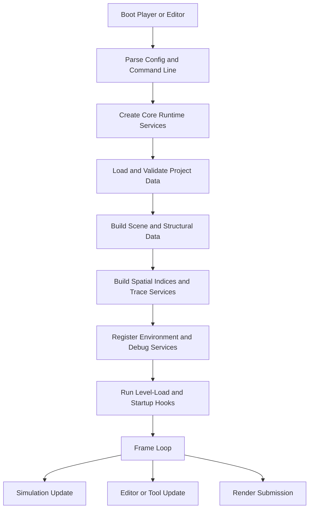

---
tags:
  - rawiron
  - engine
  - flow
  - cpp
---

# Runtime Flow

## High-Level Runtime Loop

## Current Native Runtime Shape

The current RawIron runtime is split across thin hosts and reusable native libraries.

The intended shape is:

1. Parse command line, workspace settings, and project state.
2. Create shared runtime services.
3. Load and validate authored scene and project data.
4. Build structural data and runtime-facing world state.
5. Build broadphase indices and trace helpers.
6. Attach environment, audio, debug, and instrumentation services.
7. Fire startup hooks such as level-load behavior.
8. Enter the simulation and render loop.

## Shared Runtime Services

The service layer that exists today in C++ is already meaningful:

- runtime IDs and event bus from `RawIron.Runtime`
- schema validation from `RawIron.Validation`
- structural compilation foundations from `RawIron.Structural`
- world query services from `RawIron.Spatial` and `RawIron.Trace`
- event sequencing from `RawIron.Events`
- environment and helper metrics from `RawIron.World`
- managed audio from `RawIron.Audio`
- debug snapshots and reporting from `RawIron.Debug`

## Why The Order Matters

The order is not arbitrary.

- authored data should validate before world services trust it
- structural compilation should happen before runtime queries are built
- broadphase indices should exist before traces and movement ask spatial questions
- environment and helper instrumentation should attach after world state exists
- startup hooks should run after the engine can actually mutate a real world
- editor and player hosts should stay thin so the runtime logic remains shared

## Player And Editor Principle

`RawIron.Player` and `RawIron.Editor` should both sit on the same runtime spine.

That means:

- one world model
- one event model
- one asset pipeline
- one debug story

This is the shortest path toward the Source-like feeling RawIron is after.

## Current Native Loop Split

Today, `RawIron.Core` already owns a small host/bootstrap loop.

The long-term split should look more like this:

- simulation update
- render update
- editor/tooling update

That mirrors the prototype's step-versus-render separation, but the ownership moves into native code instead of browser callbacks.

The current native loop is also now less wasteful by default than the earlier scaffold:

- fixed-step pacing is enabled by default
- frame-by-frame loop logging is opt-in instead of always-on
- player and editor hosts now log the first frame by default instead of spamming every frame

That keeps the bootstrap hosts useful for tests and diagnostics without behaving like runaway debug scripts at idle.

## Verification Hooks Today

RawIron already has native verification surfaces even before the full editor exists:

- CTest suites under MSVC and Clang
- `ri_tool --workspace`
- `ri_tool --ensure-workspace`
- `ri_tool --sample-scene`
- `ri_tool --scenekit-targets`
- `ri_tool --scenekit-example <slug>`
- `ri_tool --vulkan-diagnostics`
- `ri_tool --postprocess-presets`
- `ri_tool --save-scene-state`
- `ri_tool --load-scene-state`
- `ri_tool --asset-standardize <source-path>`
- native debug snapshot and report formatting

The future editor and player overlays should build on those same runtime services instead of inventing separate inspection paths.

## Key Runtime Rule

The runtime should behave like an authored engine platform, not just "load something and tick forever."

That means startup flow, world construction, query services, events, debugging, and tooling all need to live in a stable native order that the editor and shipped runtime can share.

## Related Notes

- [[00 Engine Home]]
- [[02 World Systems]]
- [[03 Event Engine]]
- [[05 Debugging and Instrumentation]]
