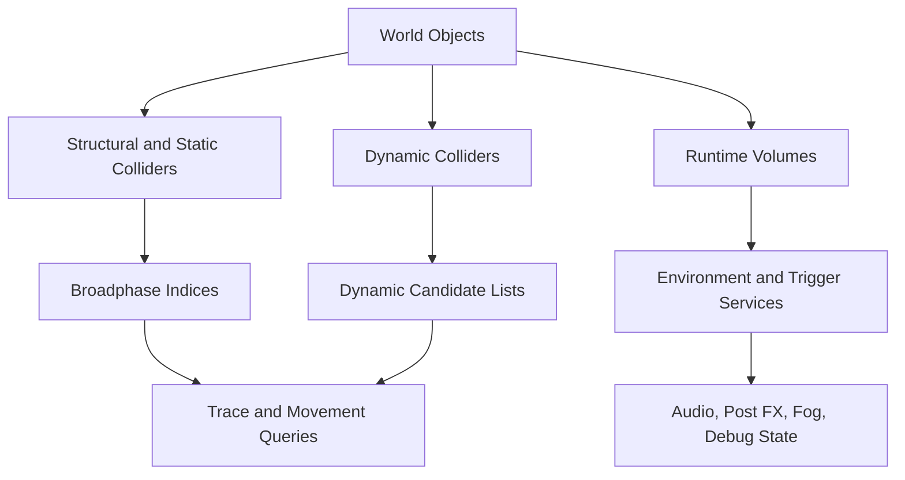

---
tags:
  - rawiron
  - engine
  - systems
  - world
---

# World Systems

## World Query Model

RawIron follows the same broad world idea the prototype proved out:

- static world data
- dynamic world data

Static world data is suited to spatial indexing.
Dynamic world data stays live and queryable without pretending it belongs in the same bucket.

## Spatial Query Graph

## Current Native Foundation

RawIron already owns the first world-system layers in C++.

### `RawIron.Structural`

Current structural foundations:

- explicit dependency graphing
- phase buckets such as `compile`, `runtime`, `post_build`, and `frame`
- convex clipping
- compiled geometry-fragment helpers
- native structural primitive builders for `box`, `plane`, `hollow_box`, `ramp`, `wedge`, `cylinder`, `cone`, `pyramid`, `capsule`, `frustum`, `geodesic_sphere`, `arch`, `hexahedron`, `convex_hull`, `roof_gable`, and `hipped_roof`
- native boolean-operator compile helpers for `union`, `intersection`, and `difference` over structural solids
- native convex-hull aggregate compilation over authored target node groups
- native authored `array_primitive` and `symmetry_mirror_plane` expansion helpers
- native authored `bevel_modifier_primitive` metadata application for targeted/intersecting boxes
- native `structural_detail_modifier` and `non_manifold_reconciler` compile helpers
- native structural compile orchestration that runs symmetry, array, modifier, aggregate, reconcile, and boolean passes in one result-producing flow
- native compile-time cutter-volume orchestration for targeted subtractive and intersect clipping over additive structural solids
- native deferred-operation execution helpers for terrain cutouts, shrinkwrap hull generation, deterministic surface scatter, spline-driven mesh placement, projected spline decal ribbons, topological UV remapping, tri-planar staging, and instance-cloud primitives

This is the seed of the engine's authored structural language.

### `RawIron.Spatial`

Current broadphase foundations:

- axis-aligned bounds
- ray and box candidate queries
- BSP-style index structure

### `RawIron.Trace`

Current shared trace helpers:

- overlap box tracing
- nearest-hit ray tracing
- swept-box tracing
- slide movement
- ground probing

That matters because movement, tools, and gameplay systems can ask the same world questions.

### `RawIron.World`

Current runtime world services:

- NPC-facing state machines for **patrol / interaction** (`NpcAgentState`) and **hostile phases** (`HostileCharacterAi`) — developer map in [[NPC Behavior Support]]
- inventory loadout (**hotbar / backpack / off-hand**, stacking, logic inventory gates) — [[Inventory and Possession]]
- typed runtime-volume descriptors for collision, clip, damage, camera, and safe-zone behavior
- typed runtime-volume descriptors for custom gravity, directional wind, buoyancy, surface velocity, and radial force helpers
- typed runtime-volume descriptors for physics-constraint axis locks
- typed runtime-volume descriptors for traversal links, ladder/climb helpers, and local grid snap volumes
- typed runtime-volume descriptors for hint/skip brushes, camera confinement, lod override, and navmesh modifier helpers
- typed runtime-volume descriptors for ambient audio volumes and spline-based ambient audio helpers
- typed runtime-volume descriptors for generic trigger volumes and spatial query volumes
- typed runtime-volume descriptors for streaming level, checkpoint spawn, teleport, launch, and analytics heatmap helpers
- typed runtime-volume descriptors for reflection probes, light-importance bounds, and light portals
- typed visibility primitives for portals, anti-portals, and occlusion portals
- typed occlusion portal runtime volumes with native closed/open state
- native creation helpers for post-process, reverb, occlusion, and fluid runtime volumes
- typed runtime-volume creation helpers for localized fog and fog blockers
- clip-mode and collision-channel parsing
- safe-zone and camera-modifier queries
- box, cylinder, and sphere volume containment
- post-process aggregation
- audio reverb and occlusion aggregation
- native physics-volume modifier aggregation for authored helper volumes, fluids, surface velocity, and radial-force flow
- native physics-constraint queries for axis-lock state
- localized fog and fog-blocker behavior
- fluid contribution to audio and post-process state
- tint-color preservation through local environment state
- helper metrics and helper activity state — logic graph wiring for `entityIo` telemetry is documented in [[Entity IO and Logic Graph]]
- runtime instrumentation counters
- runtime counts for visibility helpers and closed occlusion portals
- runtime counts for traversal links and local grid snap volumes
- runtime counts for guidance/helper volumes like hint brushes, confinement, lod override, and navmesh modifiers
- runtime counts for trigger-helper volumes like streaming, checkpoint, teleport, launch, and analytics heatmap helpers
- native trigger spatial-index rebuilds and point-query candidate collection
- native trigger spatial-query stats for index builds, point queries, and candidate counts
- authored/render-facing helper descriptors for reference image planes, annotation comments, 3D text, measure tools, render-target surfaces, planar reflection surfaces, pass-through primitives, sky projection surfaces, and volumetric emitter bounds
- checkpoint persistence, text overlay state, player vitality, and headless module verification helpers

## Structural Versus Detail Collision

RawIron already carries the distinction between structural and non-structural collision in the trace layer.

That distinction matters because the engine should be able to answer different questions cleanly:

- what blocks the player
- what counts as true world shell
- what is only detail clutter
- what is dynamic and should stay live

This is part of making the world model honest instead of turning every blocker into one anonymous pile.

The newer native volume-descriptor pass strengthens that line even further by making volume meaning explicit:

- filtered collision channels
- clip modes
- camera modifier priorities
- safe-zone inclusion

The newer authored-volume bridge in `RawIron.Content` now strengthens the earlier content side of that same seam:

- generic content values can produce typed world-volume descriptors directly
- authored size and scale aliases normalize before they become runtime extents
- volume-family defaults live in engine code instead of app glue
- environment-volume defaults and clamps now live there too

## Runtime Environment Layer

The environment service in `RawIron.World` is already behaving like real engine code, not UI glue.

It can answer:

- what post-process volumes are active here
- what local fog state applies here
- what audio shaping applies here
- what local physics helper state applies here
- what helper metrics describe this space

It can now also run native trigger orchestration for engine-owned helper volumes:

- enter, stay, and exit transitions
- typed streaming/checkpoint/teleport/launch directives
- analytics heatmap entry/time accumulation
- optional `triggerChanged` runtime-event emission
- BSP-backed trigger candidate queries instead of blanket trigger-family scans

That is the beginning of a Source-like local-environment authoring model.

## Instrumentation Seam

World systems are also where RawIron now keeps important lightweight instrumentation:

- helper activity tracking
- entity-I/O counters and recent history
- spatial-query counters
- stats-overlay state

That means the native engine already has a place to observe world behavior without hardwiring all debugging into the player shell.

## Primitive And Operator Direction

The prototype proved that the engine wants a rich authored primitive and operator language.

RawIron is not at full parity yet, but the structural direction is already clear:

- additive structural solids
- subtractive and intersect-style compile operators
- runtime helper volumes
- traversal, audio, fog, and camera-affecting volumes
- moving and post-build world helpers

The structural graph and convex compiler layers were ported first so this vocabulary can grow on a stable native base.
The newer structural passes now add a first real authored-shape kit plus native boolean-operator compilation on top of it.

## What Still Needs To Mature

Important layers that still need deeper runtime/editor maturity include:

- final runtime instantiation for all authored content and standardized asset documents
- richer moving world objects beyond the current structural/runtime-helper foundations
- more editor-facing world inspection tools
- tighter render/editor feedback for the newer visual helper descriptors

## Practical Consequence

RawIron should treat world systems as shared services, not one-off feature code.

That means:

- traces should stay reusable
- structural ordering should stay explicit
- environment shaping should stay data-driven
- instrumentation should stay close to the runtime instead of drifting into UI hacks

## Related Notes

- [[00 Engine Home]]
- [[01 Runtime Flow]]
- [[03 Event Engine]]
- [[05 Debugging and Instrumentation]]
