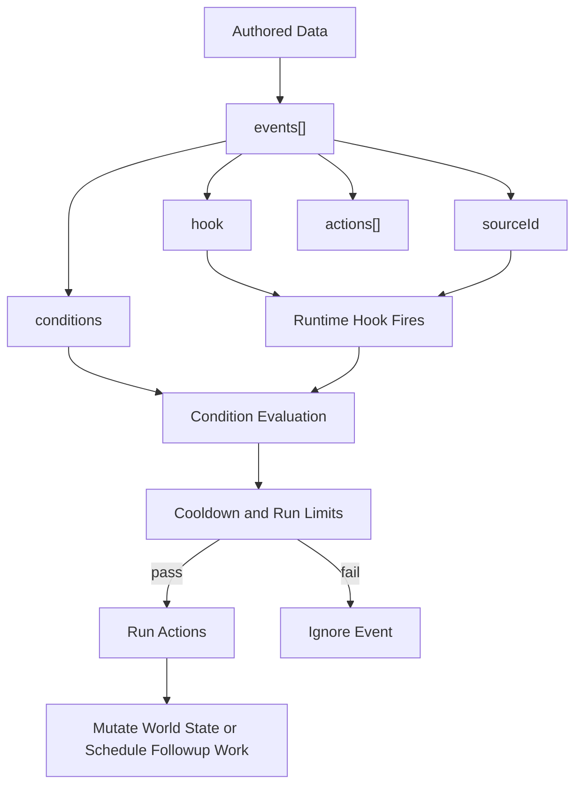

---
tags:
  - rawiron
  - engine
  - events
  - cpp
---

# Event Engine

## Purpose

The event engine exists to keep sequencing and authored runtime behavior data-driven instead of turning RawIron into a pile of one-off branches.

This is one of the core systems the prototype got right, so the native engine is preserving it on purpose.

## Event Model

## Current Native Support

`RawIron.Events` already owns the native event-flow foundation.

### Conditions

Supported condition families:

- `requiredFlags`
- `missingFlags`
- `valuesAtLeast`
- `valuesAtMost`
- `valuesEqual`

### Event Lifetime Controls

Supported runtime controls:

- `once`
- `cooldownMs`
- `maxRuns`
- `consumeInteraction`
- `stopAfterMatch`

### Built-In Action Flow

Current engine-owned actions include:

- `set_flag`
- `set_value`
- `add_value`
- `run_group`
- `run_sequence`
- `if`
- `delay`
- `cancel_sequence`
- `cancel_timer`

### Grouping And Sequencing

The native engine already supports:

- target groups
- action groups
- named sequences
- named timers

## Hook Vocabulary

RawIron keeps hooks string-driven rather than baking the engine around one hardcoded enum.

That is the right shape for an engine because it lets the runtime keep the prototype's useful hook language without making the event core depend on one game's exact surface vocabulary.

## Engine Boundary

The current event engine is intentionally split in two parts:

- generic control flow lives in `RawIron.Events`
- game-, editor-, or tool-specific behavior lives in executor callbacks

That keeps the engine honest.

The event system should know how to:

- normalize events
- evaluate conditions
- mutate generic world state
- schedule sequences and timers

It should not hardcode:

- one game's alarms
- one game's enemies
- one game's UI messages
- one game's mission scripting

## Relationship To Local Logic

The prototype taught an important lesson:

- events are best for broad scenario beats
- local entity-I/O and room logic are best for local chains

RawIron is already porting the instrumentation around entity-I/O behavior, and the broader native local-logic layer should grow beside the event system rather than being stuffed into it.

## Why This System Matters

Without an event engine, authored spaces get more brittle every time the project grows.

With one, RawIron can express:

- level-load beats
- trigger-driven beats
- delayed sequences
- flag and value progression
- reusable action groups
- cancelable state transitions

in authored data instead of ad hoc runtime branches.

## Next Native Extensions

The next big value is connecting more ported runtime systems to the event core as they land:

- world services
- editor services
- asset/runtime loading hooks
- rendering and audio-facing action handlers

## Related Notes

- [[00 Engine Home]]
- [[01 Runtime Flow]]
- [[02 World Systems]]
- [[04 Level Design Patterns]]
