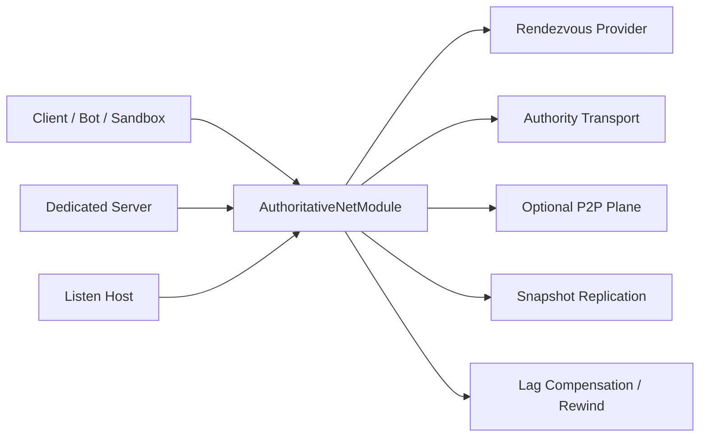

# Multiplayer

Multiplayer is a shared engine feature, not a sidecar experiment.

## Core net runtime

`AuthoritativeNetConfig` and `AuthoritativeNetModule` in `RawIron.Runtime` provide the main engine surface.

## Supported modes

- `Dedicated`
- `ListenHost`
- `HybridP2P`
- `ClientOnly`

## Supported rendezvous providers

- `EpicOnlineServices` — Lobby join codes `EOS:<lobbyId>` that resolve to an ENet `host:port` via the public `RI_TOKEN` lobby attribute. Requires `RAWIRON_USE_EOS=ON`, SDK under `ThirdParty/EOS/SDK`, and `eos_config.json`.
- `DirectToken` — LAN/dev codes `RI1:host:port:mode` (no Epic account needed)
- `None`

Gameplay packets always ride **ENet** (`RAWIRON_USE_ENET=ON`). EOS is rendezvous only.

## Packet resource boundary

The runtime accepts at most `kMaxNetPacketPayloadBytes` (4 MiB plus a 64-byte protocol-envelope
allowance) per packet. Every ENet host lowers `maximumPacketSize` from ENet's 32 MiB default before
its first service call, so oversized fragmented messages are rejected before ENet allocates their
reassembly packet. ENet's waiting-data threshold is also lowered so adding one maximum-size packet
cannot push a peer above the 32 MiB aggregate receive ceiling. `AuthoritativeNetModule` repeats the
payload, per-poll event, and aggregate-byte checks so alternate transports cannot bypass the
contract. Oversized outbound packets are rejected before transport allocation as well.

Latency simulation is bounded by both packet count and retained payload bytes. Its queue holds at
most 4,096 packets and 32 MiB of payload; exceeding either limit drops the new packet and increments
separate diagnostics exposed through `net.metrics`. ENet copies at most 32 MiB of accepted payload
per poll. `PollReceive(maxPackets)` budgets all serviced transport events, including rejected packets
and connect/disconnect churn, and clamps hostile direct requests to 4,096 events. RuntimeNetcode uses
a 128-event authority/P2P frame budget, validates custom-transport result counts and bytes, and
dispatches at most 128 ready latency-queue packets per frame. A delayed burst therefore drains over
multiple frames instead of emitting all 4,096 queued events at once.

These are engine allocation and per-frame work limits, not bandwidth rate limiting or an application
command schema or per-peer bandwidth rate limiter. Valid traffic can still consume the documented
per-peer waiting-data allowance. Repeated protocol offenders on an **authoritative host** (oversized or malformed packets
from a client) receive escalating soft cooldowns (`net.peer.cooldown`, 250 ms base doubling
to 8 s) during which further inbound packets from that peer are dropped as `peer_cooldown`
without extending the cooldown. Clients never apply this cooldown to the authority — a
malformed host snapshot requests a full resync instead of muting gameplay. The client keeps
its last good snapshot baseline while that resync is in flight, so a later valid delta can
still apply if the host rate-limits `0xA8`. Authority and
P2P offense maps are separate so a side-channel strike cannot silence the gameplay plane.
Unauthenticated snapshot resync requests (`0xA8`) are accepted at most once per 250 ms per
peer. Hard disconnect/kick of offenders remains a later transport control. Command
authorization remains the responsibility of the authority protocol layered above transport.
Transport objects are runtime-thread confined; callers must add their own synchronization before
using a transport from multiple threads.
Use `RawIron.Runtime.NetPacketResourceBoundarySmoke` for exact-limit, oversized, aggregate-byte,
dispatch-isolation, and outbound rejection coverage.

## Engine net features

- authoritative server/client flow
- snapshot replication (reliable delivery; decode/apply reject requests a full resync without
  dropping the last good client baseline)
- lag compensation and rewind buffers
- latency simulation
- optional side-channel P2P plane
- host migration state tracking
- join code issuance and resolution
- prediction and correction telemetry

## Mode model

- `Dedicated`: authoritative host only, best for stable server ownership
- `ListenHost`: one playable host owns authority and also participates as a client
- `HybridP2P`: authoritative flow plus optional P2P side plane for non-critical traffic
- `ClientOnly`: joins an existing authority without hosting it

## Runtime flow

1. A host builds `AuthoritativeNetConfig`.
2. The runtime mounts `AuthoritativeNetModule`.
3. A rendezvous provider is chosen, commonly `eos` or `direct`.
4. Authority and optional P2P transports are created.
5. Snapshot replication, prediction, and correction telemetry run inside the shared runtime loop.
6. Games consume the resulting session behavior through runtime services and game modules rather than hand-rolled net stacks.

## Multiplayer apps

- `RawIron.DedicatedServer`: authoritative headless host
- `RawIron.BotClient`: headless load and swarm client
- `RawIron.MultiplayerSandboxGame`: game-facing multiplayer testbed

## Typical command line surfaces

Common options across server, bot, and sandbox flows include:

- `--net-mode`
- `--host` or `--host-port`
- `--port`
- `--connect-host`
- `--connect-port`
- `--advertise-host` — IP/hostname written into join codes (defaults to detected LAN IP when bind is `0.0.0.0`; a wildcard or loopback value is rejected and re-detected, since no remote peer could dial it)
- `--p2p-port`
- `--rendezvous=direct|eos`
- `--issue-join-code`
- `--join-code=<code>` — joining clients only (`RawIron.BotClient`, `RawIron.MultiplayerSandboxGame`). A client that cannot resolve its code fails startup rather than dropping into an offline world.
- `--net-tick`
- `--server-tick`
- `--max-peers`
- `--sim-net`
- `--sim-delay-ms`
- `--sim-jitter-ms`
- `--sim-loss-pct`

Convenience launchers at the repo root:

- `Host RawIron EOS Dedicated.cmd [advertise-host]` — dedicated server + EOS join code
- `Join RawIron EOS Client.cmd EOS:<lobbyId>` — sandbox client join

## Project-side data

Games also carry network and persistence authoring surfaces such as:

- `scripts/network.riscript`
- `scripts/persistence.riscript`
- `config/network.cfg`

## Multiplayer workspace roles

- `RawIron.DedicatedServer` is the clean headless authoritative host
- `RawIron.BotClient` is the load and swarm exerciser
- `RawIron.MultiplayerSandboxGame` is the playable integration bed
- game projects provide the config and authored data that shape network behavior

## Reference paths

- `Source/RawIron.Runtime/include/RawIron/Runtime/RuntimeNetcode.h`
- `Apps/RawIron.DedicatedServer/src/main.cpp`
- `Apps/RawIron.BotClient/src/main.cpp`
- `Games/RawIronMultiplayerSandbox/Runtime/src/MultiplayerSandboxRuntime.cpp`

## Best place to explore the stack

[[03 Projects/RawIron Multiplayer Sandbox|RawIron Multiplayer Sandbox]] is the most complete in-repo exercise bed for multiplayer support.
