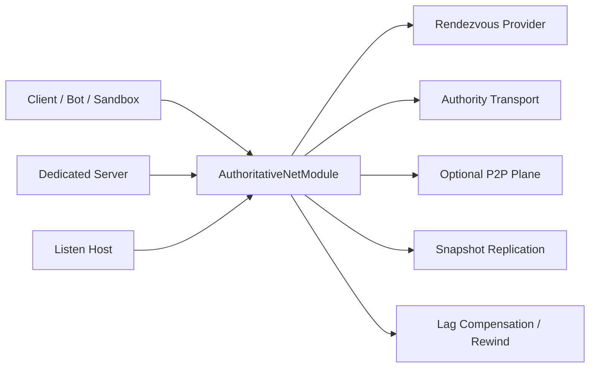

# Multiplayer

Multiplayer is a shared engine feature, not a sidecar experiment.

## Core net runtime

`AuthoritativeNetConfig` and `AuthoritativeNetModule` in `RawIron.Runtime` provide the main engine surface.

## Supported modes

- `Dedicated`
- `ListenHost`
- `HybridP2P`
- `ClientOnly`

## Supported rendezvous providers

- `EpicOnlineServices`
- `DirectToken`
- `None`

## Engine net features

- authoritative server/client flow
- snapshot replication
- lag compensation and rewind buffers
- latency simulation
- optional side-channel P2P plane
- host migration state tracking
- join code issuance and resolution
- prediction and correction telemetry

## Mode model

- `Dedicated`: authoritative host only, best for stable server ownership
- `ListenHost`: one playable host owns authority and also participates as a client
- `HybridP2P`: authoritative flow plus optional P2P side plane for non-critical traffic
- `ClientOnly`: joins an existing authority without hosting it

## Runtime flow

1. A host builds `AuthoritativeNetConfig`.
2. The runtime mounts `AuthoritativeNetModule`.
3. A rendezvous provider is chosen, commonly `eos` or `direct`.
4. Authority and optional P2P transports are created.
5. Snapshot replication, prediction, and correction telemetry run inside the shared runtime loop.
6. Games consume the resulting session behavior through runtime services and game modules rather than hand-rolled net stacks.

## Multiplayer apps

- `RawIron.DedicatedServer`: authoritative headless host
- `RawIron.BotClient`: headless load and swarm client
- `RawIron.MultiplayerSandboxGame`: game-facing multiplayer testbed

## Typical command line surfaces

Common options across server, bot, and sandbox flows include:

- `--net-mode`
- `--host` or `--host-port`
- `--port`
- `--connect-host`
- `--connect-port`
- `--p2p-port`
- `--rendezvous=direct|eos`
- `--issue-join-code`
- `--join-code=<code>`
- `--net-tick`
- `--server-tick`
- `--max-peers`
- `--sim-net`
- `--sim-delay-ms`
- `--sim-jitter-ms`
- `--sim-loss-pct`

## Project-side data

Games also carry network and persistence authoring surfaces such as:

- `scripts/network.riscript`
- `scripts/persistence.riscript`
- `config/network.cfg`

## Multiplayer workspace roles

- `RawIron.DedicatedServer` is the clean headless authoritative host
- `RawIron.BotClient` is the load and swarm exerciser
- `RawIron.MultiplayerSandboxGame` is the playable integration bed
- game projects provide the config and authored data that shape network behavior

## Reference paths

- `Source/RawIron.Runtime/include/RawIron/Runtime/RuntimeNetcode.h`
- `Apps/RawIron.DedicatedServer/src/main.cpp`
- `Apps/RawIron.BotClient/src/main.cpp`
- `Games/RawIronMultiplayerSandbox/Runtime/src/MultiplayerSandboxRuntime.cpp`

## Best place to explore the stack

[[03 Projects/RawIron Multiplayer Sandbox|RawIron Multiplayer Sandbox]] is the most complete in-repo exercise bed for multiplayer support.
