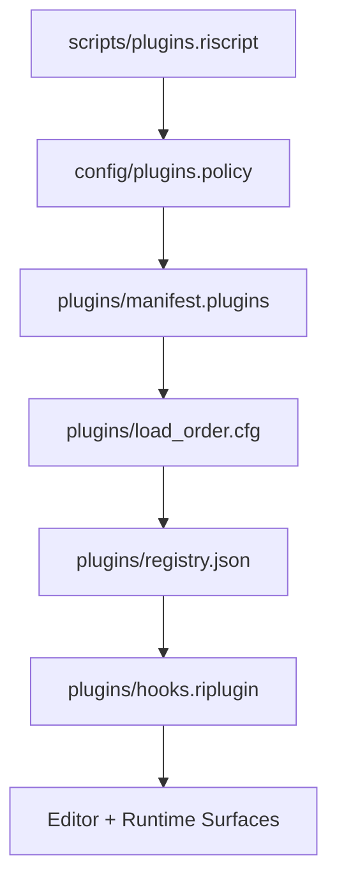

# Plugins and Mods

Plugins and mod-governance are built into the project format.

## Required plugin surfaces

Every current game contract includes:

- `scripts/plugins.riscript`
- `config/plugins.policy`
- `plugins/manifest.plugins`
- `plugins/load_order.cfg`
- `plugins/registry.json`
- `plugins/hooks.riplugin`

## Related security surface

Games also carry `config/security.policy`, which sits alongside plugin policy as part of project governance.

## What these files do

- `scripts/plugins.riscript`: authored plugin-related tuning and runtime declarations
- `config/plugins.policy`: permission and policy baseline for plugin loading
- `plugins/manifest.plugins`: plugin inventory
- `plugins/load_order.cfg`: plugin ordering
- `plugins/registry.json`: plugin registry metadata
- `plugins/hooks.riplugin`: hook declarations consumed by runtime and editor surfaces

## Extension taxonomy

RawIron now treats extension classes as distinct, even when they share some control-plane files:

- `mods` modify existing engine, editor, or game behavior
- `plugins` add new abilities or systems
- `data packs` inject or override data, variables, assets, and content
- `pipes` route services into external tools, providers, or companion apps

Store packages can now declare an explicit `extension` descriptor so tooling can reason about `kind`, `scope`, `host`, `entry`, and capability tags without inferring everything from plugin-only fields.

Local project/mod entry paths are resolved by `ResolvePluginEntryPath`. Entries that escape the game root or point at a missing local file are reported and excluded from the active plugin list. Remote and absolute references remain external/unsigned inputs governed by project policy.

CLI inspection is available through `ri_tool --plugins-list`, `--plugins-doctor`, `--plugin-handlers`, and `--extension-validate`.

## Project ownership

Plugins and mods are not hidden internal features. They are first-class authored project content and are included in the shipped workspace.

The shared `.ripak` package protocol is the distribution and dependency layer beneath these
extension classes. See [[02 Engine/12 Package Runtime|Package runtime]] for manifest version 2,
dependency resolution, capabilities, permissions, and runtime entry points.

## Typical policy posture

Project policies can control things like script allowance and unsigned plugin allowance. Those policies belong in project config, not scattered through game code.

## Authoring guide

See [[02 Engine/10 Mod and Plugin Authoring|Mod and plugin authoring]] for concrete file-shape examples and authoring posture.
