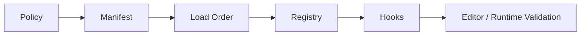

# Mod and Plugin Authoring

RawIron game projects carry plugin and mod governance as normal project data.

## Required surfaces

- `scripts/plugins.riscript`
- `config/plugins.policy`
- `config/security.policy`
- `plugins/manifest.plugins`
- `plugins/load_order.cfg`
- `plugins/registry.json`
- `plugins/hooks.riplugin`

## Authoring flow



1. Define the policy posture in `config/plugins.policy` and `config/security.policy`.
2. List plugin entries in `plugins/manifest.plugins`.
3. Define the execution/load order in `plugins/load_order.cfg`.
4. Register plugin metadata in `plugins/registry.json`.
5. Bind hook names, events, and priorities in `plugins/hooks.riplugin`.
6. Keep any plugin-related tuning in `scripts/plugins.riscript`.

## Example: `plugins/manifest.plugins`

From the Liminal Hall project:

```text
# plugin_id,version,category,entry
liminal.telemetry,1.0,telemetry,plugins/hooks.riplugin
liminal.ai.bridge,1.0,ai,plugins/hooks.riplugin
liminal.cinematics,1.0,cinematic,plugins/hooks.riplugin
```

## Example: `plugins/load_order.cfg`

```text
# plugin_id=order
liminal.telemetry=10
liminal.ai.bridge=20
liminal.cinematics=30
```

## Example: `plugins/registry.json`

```json
{
  "plugins": [
    {
      "id": "liminal.telemetry",
      "enabled": true,
      "hookGroup": "runtime.telemetry"
    },
    {
      "id": "liminal.ai.bridge",
      "enabled": true,
      "hookGroup": "runtime.ai"
    },
    {
      "id": "liminal.cinematics",
      "enabled": true,
      "hookGroup": "runtime.cinematics"
    }
  ]
}
```

## Example: `plugins/hooks.riplugin`

```text
# hook,plugin,event,priority
startup,liminal.telemetry,bootstrap,10
startup,liminal.ai.bridge,ai_policy_bind,20
startup,liminal.cinematics,timeline_register,30
runtime,liminal.telemetry,frame_sample,40
runtime,liminal.ai.bridge,mode_update,50
runtime,liminal.cinematics,zone_cutscene_trigger,60
```

## Example: policy files

`config/plugins.policy`

```text
allow_runtime_plugin_overrides = 1
allow_unsigned_plugins = 0
max_plugin_hook_chain = 16
plugin_startup_timeout_ms = 250
plugin_sandbox_level = 2
```

`config/security.policy`

```text
allow_mod_scripts = 0
allow_unsigned_content = 0
max_remote_clients = 6
state_checksum_enforced = 1
allow_runtime_plugin_overrides = 1
runtime_command_gate = 1
allow_external_asset_roots = 0
```

## Authoring posture

- keep permission and trust decisions in policy files
- keep plugin inventory and order explicit
- keep runtime hooks declarative
- keep project-specific plugin tuning in `scripts/plugins.riscript`
- do not bury plugin governance inside one-off C++ branches when it belongs in project data
