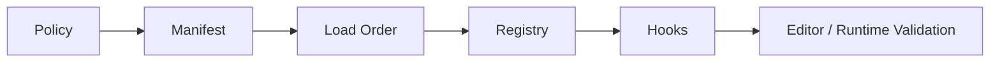
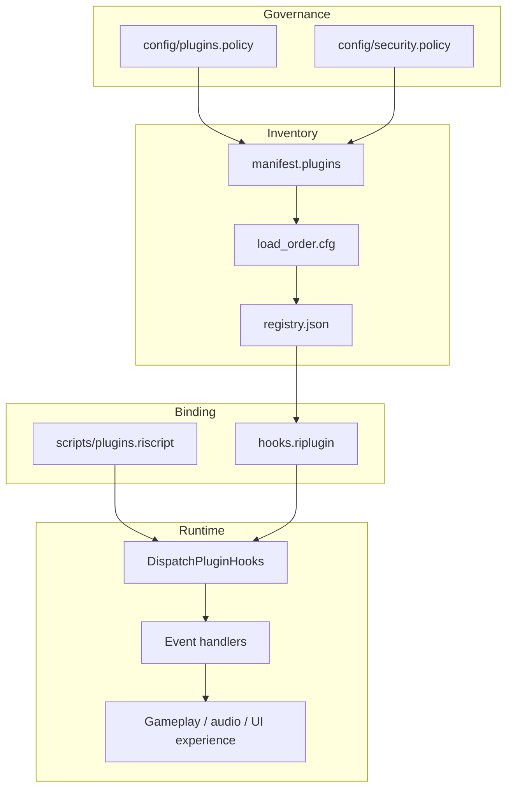

# Mod and Plugin Authoring

RawIron game projects carry plugin and mod governance as normal project data.

## Required surfaces

- `scripts/plugins.riscript`
- `config/plugins.policy`
- `config/security.policy`
- `plugins/manifest.plugins`
- `plugins/load_order.cfg`
- `plugins/registry.json`
- `plugins/hooks.riplugin`

## Authoring flow



1. Define the policy posture in `config/plugins.policy` and `config/security.policy`.
2. List plugin entries in `plugins/manifest.plugins`.
3. Define the execution/load order in `plugins/load_order.cfg`.
4. Register plugin metadata in `plugins/registry.json`.
5. Bind hook names, events, and priorities in `plugins/hooks.riplugin`.
6. Keep any plugin-related tuning in `scripts/plugins.riscript`.

## Example: `plugins/manifest.plugins`

From the Liminal Hall project:

```text
# plugin_id,version,category,entry
liminal.telemetry,1.0,telemetry,plugins/hooks.riplugin
liminal.ai.bridge,1.0,ai,plugins/hooks.riplugin
liminal.cinematics,1.0,cinematic,plugins/hooks.riplugin
```

## Example: `plugins/load_order.cfg`

```text
# plugin_id=order
liminal.telemetry=10
liminal.ai.bridge=20
liminal.cinematics=30
```

## Example: `plugins/registry.json`

```json
{
  "plugins": [
    {
      "id": "liminal.telemetry",
      "enabled": true,
      "hookGroup": "runtime.telemetry"
    },
    {
      "id": "liminal.ai.bridge",
      "enabled": true,
      "hookGroup": "runtime.ai"
    },
    {
      "id": "liminal.cinematics",
      "enabled": true,
      "hookGroup": "runtime.cinematics"
    }
  ]
}
```

## Example: `plugins/hooks.riplugin`

```text
# hook,plugin,event,priority
startup,liminal.telemetry,bootstrap,10
startup,liminal.ai.bridge,ai_policy_bind,20
startup,liminal.cinematics,timeline_register,30
runtime,liminal.telemetry,frame_sample,40
runtime,liminal.ai.bridge,mode_update,50
runtime,liminal.cinematics,zone_cutscene_trigger,60
```

## Example: policy files

`config/plugins.policy`

```text
allow_runtime_plugin_overrides = 1
allow_unsigned_plugins = 0
max_plugin_hook_chain = 16
plugin_startup_timeout_ms = 250
plugin_sandbox_level = 2
```

`config/security.policy`

```text
allow_mod_scripts = 0
allow_unsigned_content = 0
max_remote_clients = 6
state_checksum_enforced = 1
allow_runtime_plugin_overrides = 1
runtime_command_gate = 1
allow_external_asset_roots = 0
```

## Authoring posture

- keep permission and trust decisions in policy files
- keep plugin inventory and order explicit
- keep runtime hooks declarative
- keep project-specific plugin tuning in `scripts/plugins.riscript`
- do not bury plugin governance inside one-off C++ branches when it belongs in project data

## Engine API (C++)

RawIron loads plugins as **declarative project data** — not native DLLs. The Content layer exposes:

| API | Role |
|-----|------|
| `LoadPluginProjectData(gameRoot)` | Parses manifest, registry, hooks, policy; classifies plugin source kind; annotates policy-blocked entries; validates cross-references; builds active plugin list |
| `BuildActivePlugins(data)` | Resolves enabled plugins in load-order with attached hooks |
| `CollectHooksForPhase(data, phase)` | Returns hooks for `startup`, `runtime`, etc. sorted by priority |
| `GamePluginRuntimeSession` | Game-loop holder: `Bootstrap()` + throttled `TickRuntime()` |
| `BootstrapGamePlugins(gameRoot)` | One-shot load + startup hook dispatch for games and editor |
| `PluginRuntimeEventSink` | Optional callback wired to `RuntimeEventBus` in games |
| `DispatchPluginHooks(context, phase)` | Executes registered event handlers (`bootstrap`, `ambient_tick`, …) |
| `DescribePluginModificationModel()` | Human-readable summary of the mod pipeline |

Hook handlers live in `Source/RawIron.Content/src/PluginRuntime.cpp`. Games use `Games/Common/GamePluginRuntimeBridge` for bootstrap, throttled ticks, render tuning, and optional `RuntimeEventBus` fan-out.

### Shared game bridge (`GamePluginRuntimeBridge`)

| API | Role |
|-----|------|
| `BootstrapGamePluginRuntime(host, gameRoot)` | Load + startup hooks + logging |
| `WireGamePluginEventBus(host)` | Connect sink after runtime bus is available |
| `TickGamePluginRuntime(host, elapsedSeconds)` | Throttled runtime hook dispatch |
| `ApplyGamePluginRenderTuning(host, tuning)` | Apply ambient gain / render boost to live tuning |
| `MaybeLogPluginDiagnostics(host, visible, dt)` | Periodic `[Plugins]` log when diagnostics overlay is on |
| `SummarizeGamePluginDiagnostics(host)` | One-line status for overlays / logs |

## How plugins mod the engine and experience



1. **Policy** gates what may load (`allow_unsigned_plugins`, sandbox level, max hook chain).
2. **Manifest + registry** declare which packages exist and whether they are enabled.
3. **Load order** resolves conflicts when multiple plugins touch the same surface.
4. **Hooks** bind lifecycle phases (`startup`, `runtime`) to named events (`bootstrap`, `quest_marker_refresh`, …).
5. **Handlers** apply experience changes: ambient gain ticks, quest marker refresh, AI policy bridges, cinematic triggers — without recompiling the executable.

`LoadPluginProjectData()` now classifies each manifest row as `project`, `mod`, or `external`, and records `policyBlockReason` on entries that are present in project data but not allowed to execute. `BuildActivePlugins()` excludes those blocked entries instead of silently treating policy as informational.

## Plugin Store (editor)

Workspace packages live under `Plugins/Store/<package-id>/package.riplugin.json`. The editor **Store** inspector tab lists available packages, shows install state, and writes into the mounted game's `plugins/` folder (manifest, load order, registry, hooks).

Example store packages shipped with RawIron:

- `Plugins/Store/rawiron.ambient-presence` — audio zone binding + ambient ticks
- `Plugins/Store/rawiron.quest-beacons` — quest marker refresh hooks
- `Plugins/Store/rawiron.telemetry-lite` — lightweight frame sampling for diagnostics

Install flow: **Store → Install** merges package metadata into project plugin files. **Enable / Disable** toggles `registry.json`. **Remove** uninstalls a package from project plugin files. **Prev / Next** scroll the store catalog. Press **5** in the editor to jump to the Store tab. Cards show an optional **badge** (Audio, Gameplay, Telemetry), source kind, and policy-block state. When policy disallows a package, the card stays visible with a blocked reason instead of disappearing into validation-only state.

At play time, games use `GamePluginRuntimeBridge` (`BootstrapGamePluginRuntime`, `TickGamePluginRuntime`, `ApplyGamePluginRenderTuning`) during init and throttled runtime ticks. Liminal Hall, Wilderness Ruins, and Multiplayer Sandbox are wired.

CI:
- `RawIron.Editor.PluginStorePackages` validates every `Plugins/Store/*/package.riplugin.json` descriptor.
- `RawIron.Content.ExtensionDescriptorSmoke` validates the shared extension taxonomy descriptor (`mod`, `plugin`, `data-pack`, `pipe`) and nested `extension` object parsing.
- `RawIron.Content.PluginProjectData` verifies bundled games ship the full plugin project surface.
- `RawIron.Content.PluginProjectDataSmoke` exercises mixed plugin file shapes and policy-block metadata.
- `RawIron.Content.BundledPluginProjectDataSmoke` loads the bundled game plugin data and requires zero validation issues.
- `RawIron.Editor.PluginManagerSmoke` exercises install / uninstall behavior, including policy-blocked install attempts.
- `LoadPluginProjectData` reports issues when `hooks.riplugin` references event names with no engine handler (`AppendPluginHookHandlerIssues`).

Standalone diagnostics: toggle with **Ctrl+Shift+U** (Forest Ruins, Multiplayer Sandbox) or **Ctrl+Shift+L** (Liminal Hall logic layer, which also shows the plugin HUD). The overlay lists active plugins and recent hook events.

## Example store package (`package.riplugin.json`)

```json
{
  "id": "rawiron.ambient-presence",
  "name": "Ambient Presence",
  "version": "1.0.0",
  "author": "RawIron",
  "category": "audio",
  "badge": "Audio",
  "tagLine": "Layered ambient ticks and zone binding for liminal spaces.",
  "description": "Startup audio zone binding and runtime ambient gain ticks.",
  "loadOrder": 40,
  "hookGroup": "runtime.audio",
  "manifestLine": "rawiron.ambient-presence,1.0.0,audio,plugins/hooks.riplugin",
  "hooks": [
    "startup,rawiron.ambient-presence,audio_zones_bind,15",
    "runtime,rawiron.ambient-presence,ambient_tick,45"
  ],
  "extension": {
    "id": "rawiron.ambient-presence",
    "displayName": "Ambient Presence",
    "version": "1.0.0",
    "kind": "plugin",
    "scope": "game",
    "host": "runtime",
    "entry": "plugins/hooks.riplugin",
    "description": "Runtime audio presence hooks for ambient binding and gain ticks.",
    "capabilities": ["audio.runtime", "gameplay.events"],
    "tags": ["ambient", "audio", "atmosphere"]
  }
}
```

The nested `extension` object is the shared taxonomy descriptor. It gives RawIron one vocabulary for `mod`, `plugin`, `data-pack`, and `pipe` packages while preserving the current plugin install surfaces.
