# Releases

RawIron ships user-facing GitHub releases as a split full-workspace archive plus installer.

```mermaid
flowchart LR
    A["D:\\RawIron"] --> B["Exclude ReleaseArtifacts"]
    B --> C["Create Full ZIP"]
    C --> D["Split Into Parts"]
    D --> E["Upload Parts To GitHub Release"]
    E --> F["Upload Installer"]
    F --> G["User Downloads Parts + Installer"]
    G --> H["Installer Reassembles ZIP"]
    H --> I["Installer Verifies SHA256"]
    I --> J["Installer Extracts Workspace"]
```

## Packaging rule

Package the full `D:\RawIron` workspace and exclude only `D:\RawIron\ReleaseArtifacts`.

## Release shape

A published release contains:

- split archive parts such as `RawIron_full_release_with_builds.zip.part01`, `part02`, `part03`, and additional parts when required by size
- `RawIron_Installer.zip`
- release notes with the SHA256 for the reassembled main archive

## Packaging flow

1. Stage the full workspace.
2. Exclude only `ReleaseArtifacts`.
3. Produce the main archive.
4. Split the archive into GitHub-safe parts.
5. Publish every part to the GitHub release.
6. Publish the installer bundle.
7. Put the final SHA256 into release notes and installer defaults.

## Installer role

The installer downloads the split parts from the GitHub release, reassembles the archive, verifies the expected hash, and extracts the workspace to the user-chosen destination.

## User-facing expectation

The released workspace is meant to be the workspace people actually run and inspect. That includes game folders, assets, build outputs, scripts, and installer support files rather than a stripped internal-only subset.

## Publishing pieces

- `Scripts/Publish-FullWorkspaceSplitZip.ps1`
- `Installer/RawIron.FullWorkspace.Installer.ps1`
- `Installer/RawIron.FullWorkspace.Installer.cmd`
- `Installer/README_REASSEMBLY.txt`

## Maintainer expectations

- release tag and installer defaults stay aligned
- release notes include the archive checksum
- attached assets include every split part required for the full workspace bundle
- the shipped bundle includes project assets, game folders, build outputs, scripts, and installer content as part of the workspace release model
